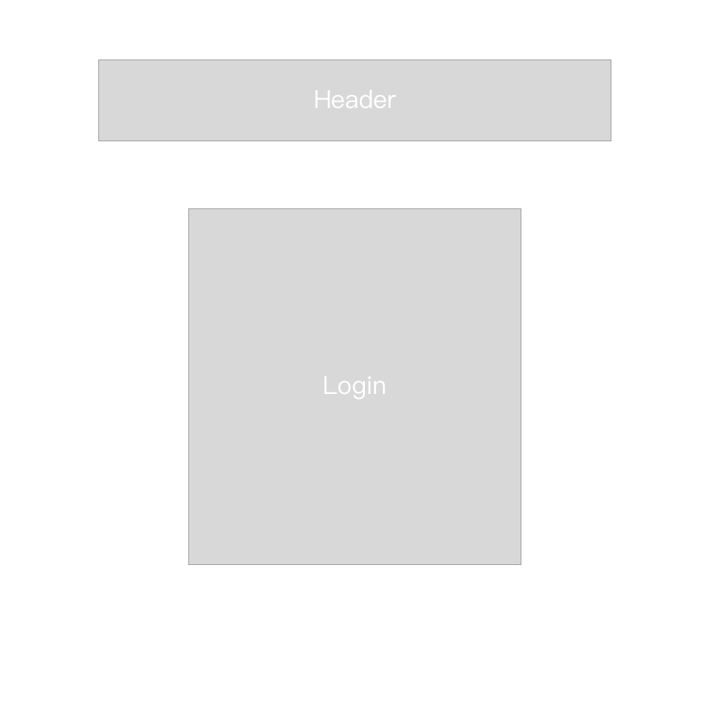
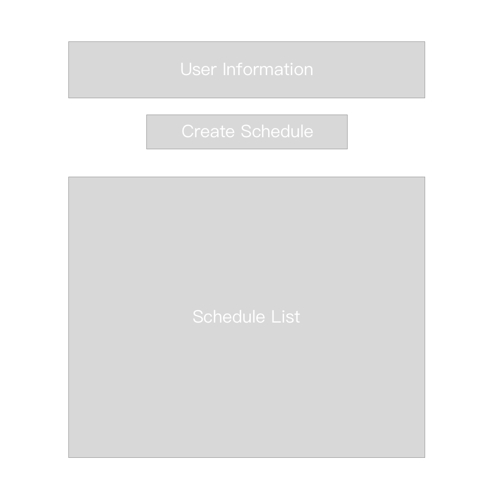
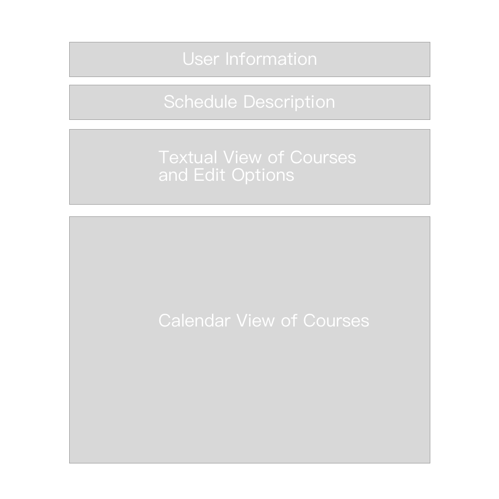
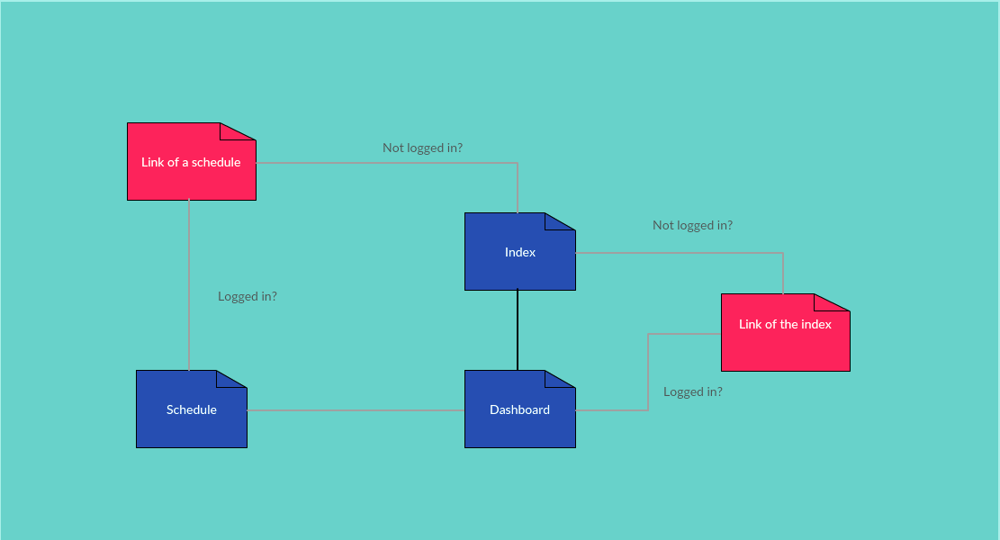
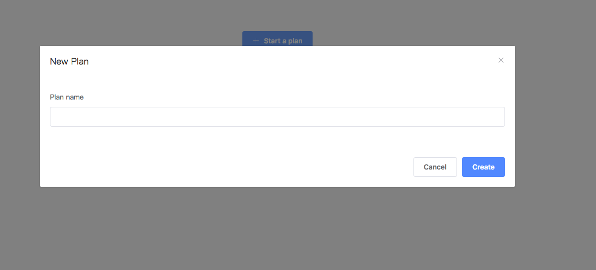
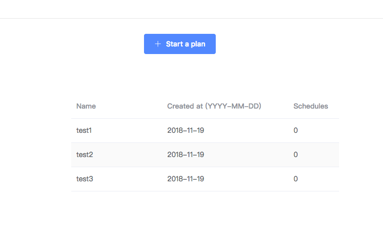

# Awesome Timetable

## Description

Students may have a difficult time arranging the courses to take next semester before course registration. There are more interesting classes than the enrollment limit every semester and students want to compare different time schedule before they make final decision. It is frustrating that one's dream class is closed before his/her registration time so plan B is necessary. Now Awesome Timetable will help students do these things.

Awesome Timetable is a web application that allow users to create their custom visual class schedule. They can create schedules, share they plans with other users and download existing plans. Users first create an empty schedule, then download course data online or input them manually to custom their schedule.

## Data Model

The application will store users, courses and schedules

- Users can have multiple schedules

- A schedule can have multiple courses

User Model
```javascript
/**
 * @property {String} username - username
 * @property {Number} pwdHash - the hash code of the password
 * @property {Array} schedules - an array of schedules the user have
 */
```

Schedule Model
```javascript
/**
 * @property {Object} owner - a reference to a user object
 * @property {String} name - name of the schedule
 * @property {Array} courses - an array of courses in the schedule
 * @property {Date} createAt - the create time
 * @property {String} identifier - a unique string to identify the schedule, used for sharing
 */
```

Course Model
```javascript
/**
 * @property {String} name - name of the course(e.g. Applied Internet Tech)
 * @property {String} code - code of the course(e.g. CSCI-UA 480)
 * @property {Array} start - an array of length 2 represents the start time of
 * the class. It contains two numbers where the first represents the hour and
 * the second represents minute
 * @property {Array} end - an array of length 2 represents the end time of
 * the class
 * @property {String} instructor - name of the instructor who teaches the course
 * @property {String} location - the location where the course is taught
 * @property {String} room - room number of the classroom
 * @property {String} desc - more information about the course
 */
```

## Wireframes

/ - The index page before user login


/user - The dashboard page, users can `add / edit / delete / share` schedule here. If the user has not logged in, he/she will be redirected to the index page


/schedule/[:identifier] - The visual schedule page. If the user is the owner of the schedule, he/she can edit it, otherwise the schedule is view-only.


There is no explicit form pages because I want to use modals to deal with forms without extra pages.

## Site Map


## User Stories
1. As a non-registered user, I can register a new account.
2. As a user, I can login in to the site.
3. As a user, I can view all of the schedules created by myself.
4. As a user, I can create a new schedule.
5. As a user, I can add / delete / edit courses in my own schedule.
6. As a user, I can share my schedule or access other users' schedules via a identifier code.
7. As a user, I can view other users' schedules in view-only mode.

## Research Topics
- (5 points) vue.js
    * This project will separate front-end and back-end. I will use vue.js as the front-end framework.

- (3 points) webpack with plugins
    * Sass and postcss
    * ESLint
    
- (3 points) client side form validation
    * axios
    
- (2 points) UI framework
    * [element ui](https://element.eleme.io/#/en-US)
    
# MileStone 2 Progress

## working form

Please create an account to have access to your dashboard. There will be a button to create a new plan. After the plan is created, an AJAX request will be sent to update the page.





## research topics

- `Vue.js` is applied. All visible elements in the website are built using Vue.js. See [here](https://github.com/nyu-csci-ua-0480-001-003-fall-2018/DaKoala-final-project/tree/master/frontend/src/views)

- `Webpack` is applied. The `backend/src/dist` directory is built using Webpack. See [here](https://github.com/nyu-csci-ua-0480-001-003-fall-2018/DaKoala-final-project/tree/master/backend/src/dist)